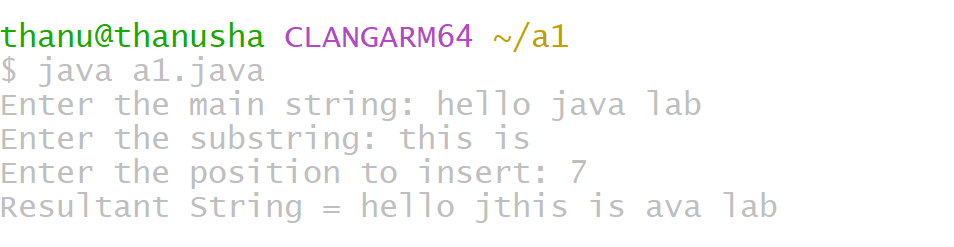

# ADDITIONAL EXPERIMENT 1
## TITLE : 1) Insert a substring into mainstring

```
import java.util.Scanner;
class SubstringInsert {
public static void main(String[] args) {
 Scanner sc = new Scanner(System.in);
String mainString;
        String subString;
        int position;
        System.out.print("Enter the main string: ");
        mainString = sc.nextLine();
        System.out.print("Enter the substring: ");
        subString = sc.nextLine();
        System.out.print("Enter the position to insert: ");
        position = sc.nextInt();
        int length = mainString.length();
        String resultString;
        if (position >= 0 && position <= length) {
            String firstPart = mainString.substring(0, position);
            String secondPart = mainString.substring(position);
            resultString = firstPart + subString + secondPart;
        System.out.println("Resultant String = " + resultString);
      } else {
            System.out.println("Substring cannot be inserted.");
            System.out.println("Condition: 0 <= position <= " + length);
    }
       sc.close();
 }
}
```

# OUTPUT



 ##TITLE : 3.) Determine if a string is a palindrome or not
```
import java.util.Scanner;
class Palindrome {
    public static void main(String[] args) {
        Scanner sc = new Scanner(System.in);
        System.out.print("Enter the string: ");
        String str = sc.nextLine();
    int start = 0;
    int end = str.length() - 1;
boolean flag = true;
while (start < end) {
     if (str.charAt(start) != str.charAt(end)) {
System.out.println("String is not a palindrome");
flag = false;
break;
}
  start++;
end--;
}
if (flag) {
System.out.println("String is a palindrome");
}
sc.close();
 }
}
```

# OUTPUT :
1[output of palindrome](expa3.png)


