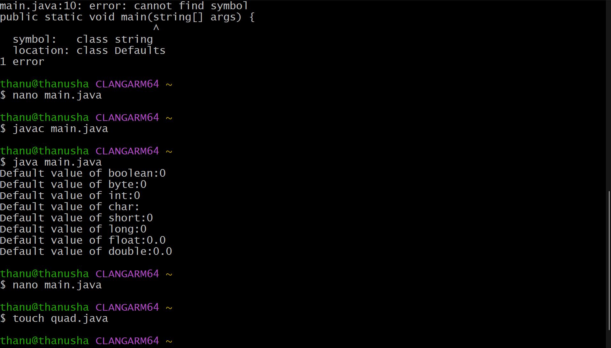

# EXPERIMENT 1
## TITLE : 1a.) Display Primitive Datatypes
```
class Defaults {
boolean bool;
byte b;
int i;
char c;
short s;
long l;
float f;
double d;
public static void main(String[] args) {
Defaults dv=new Defaults();
System.out.println("Default value of boolean:"+dv.b);
System.out.println("Default value of byte:"+dv.b);
System.out.println("Default value of int:"+dv.i);
System.out.println("Default value of char:"+dv.c);
System.out.println("Default value of short:"+dv.s);
System.out.println("Default value of long:"+dv.l);
System.out.println("Default value of float:"+dv.f);
System.out.println("Default value of double:"+dv.d);
}
}
```

# OUTPUT
 

## TITLE : 1b.) Display Quadratic Equation
```
import java.util.Scanner;
class QuadraticRoots{
public static void main(String[] args) {
Scanner sc = new Scanner(System.in);
Double a,b,c,D;
System.out.print("enter value of a: ");
a=sc.nextDouble();
System.out.print("enter value of b: ");
b=sc.nextDouble();
System.out.print("enter value of c: ");
c=sc.nextDouble();
D=b*b-4*a*c;
System.out.println("Discriminant(D)="+D);
if (D>0) {
Double x1=(-b+Math.sqrt(D))/(2*a);
Double x2=(-b-Math.sqrt(D))/(2*a);
System.out.println("Roots are real and distinct:");
System.out.println("Root1="+x1);
System.out.println("Root2="+x2);
} else if (D==0) {
Double x=-b*2/a;
System.out.println("Root="+x);
} else {
Double real=(-b/2*a);
Double imaginary=(Math.sqrt(-D)/(2*a));
System.out.println("Root1"+real+"+i"+imaginary);
System.out.println("Root2"+real+"-i"+imaginary);
} sc.close();
}
}
```

# OUTPUT

