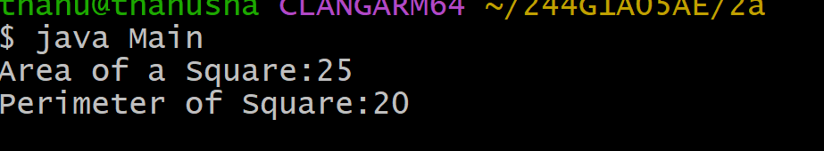
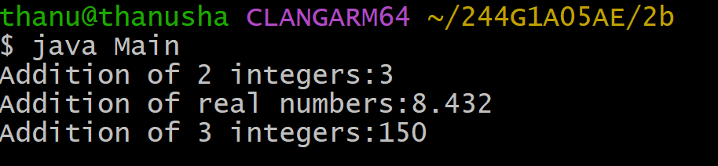

#EXPERIMENT 2
## TITLE : 2a.) Implement class mechanism
```
class Square {
int length;
int areaOfSquare() {
return length * length;
}
int perimeterOfSquare() {
return 4 * length;
}
}
class Main {
public static void main(String[] args) {
Square sq = new Square();
sq.length = 5;
int area = sq.areaOfSquare();
int perimeter = sq.perimeterOfSquare();
System.out.println("Area of a Square: " + area);
System.out.println("Perimeter of Square: " + perimeter);
}
}
```

# OUTPUT



## TITLE :2b.)Method overloading
``` java 
class Add {
 int add(int a, int b) {
return a + b;
    }
    double add(double a, double b) {
 return a + b;
 }
    int add(int a, int b, int c) {
  return a + b + c;
    }
}
class Main {
    public static void main(String[] args) {
        Add a = new Add();
        System.out.println("Addition of 2 integers: " + a.add(1, 2));
        System.out.println("Addition of real numbers: " + a.add(3.567, 4.865));
        System.out.println("Addition of 3 integers: " + a.add(40, 50, 60));
    }
}
```
# OUTPUT

