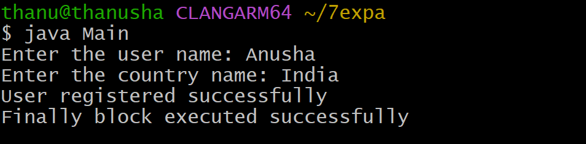
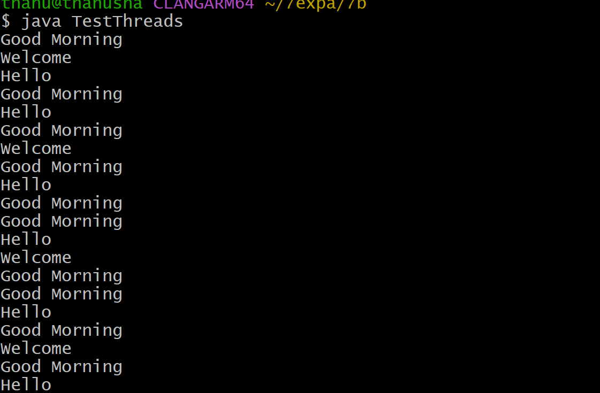
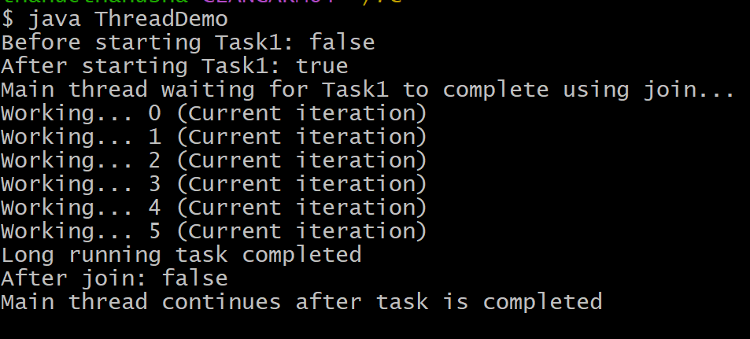

# EXPERIMENT - 7
## TITLE : 7a.)  User defined Exception 
```java
import java.util.Scanner;
class InvalidCountryException extends Exception {
 InvalidCountryException() {
        super();
    }   InvalidCountryException(String message) {
        super(message);
    }
}
class UserRegistration {
    void registerUser(String userName, String userCountry)
            throws InvalidCountryException {
        if (!userCountry.equals("India")) {
            throw new InvalidCountryException(
                    "User outside India cannot be registered");
        } else {
            System.out.println("User registered successfully");
        }
    }
}
public class Main {
    public static void main(String[] args) {
        Scanner sc = new Scanner(System.in);
        UserRegistration ur = new UserRegistration();
try {
 System.out.print("Enter the user name: ");
            String uname = sc.nextLine();
            System.out.print("Enter the country name: ");
            String cname = sc.nextLine();
            ur.registerUser(uname, cname);
        } catch (InvalidCountryException e) {
            System.out.println(e.getMessage());
        } catch (Exception e) {
            System.out.println("Unknown error: " + e);
        } finally {
            sc.close();
            System.out.println("Finally block executed successfully");
        }
    }
}
```
OUTPUT :



## TITLE : 7b.) Extending Thread class
```java
class GoodMorningThread extends Thread {
    public void run() {
        while (true) {
            System.out.println("Good Morning");
            try {
                Thread.sleep(1000); 
            } catch (InterruptedException e) {
                System.out.println("Exception occurred: " + e);
            }
        }
    }
}
class HelloThread extends Thread {
    public void run() {
        while (true) {
            System.out.println("Hello");
            try {
                Thread.sleep(2000); 
            } catch (InterruptedException e) {
                System.out.println("Exception occurred: " + e);
            }
        }
    }
}
class WelcomeThread extends Thread {
    public void run() {
        while (true) {
            System.out.println("Welcome");
            try {
                Thread.sleep(3000);
            } catch (InterruptedException e) {
                System.out.println("Exception occurred: " + e);
            }
        }
    }
}
public class TestThreads {
    public static void main(String[] args) {
        GoodMorningThread t1 = new GoodMorningThread();
        HelloThread t2 = new HelloThread();
        WelcomeThread t3 = new WelcomeThread();
  t1.start();
        t2.start();
        t3.start();
    }
}
```
OUTPUT :



## TITLE : 7c.) Java program illustrating isAlive and join scenario
```java
class LongRunningTask extends Thread {
   public void run() {
for (int i = 0; i <= 5; i++) {
            System.out.println("Working... " + i + " (Current iteration)");
     try {
                Thread.sleep(1000); 
            } catch (InterruptedException e) {
                System.out.println("Exception occurred: " + e);
            }
        }
        System.out.println("Long running task completed");
    }
}
public class ThreadDemo {
    public static void main(String[] args) {
        LongRunningTask task1 = new LongRunningTask();
        System.out.println("Before starting Task1: " + task1.isAlive());
        task1.start();
        System.out.println("After starting Task1: " + task1.isAlive());
        try {
            System.out.println("Main thread waiting for Task1 to complete using join...");
            task1.join();  
        } catch (InterruptedException e) {
            System.out.println("Join interrupted: " + e);
        }
        System.out.println("After join: " + task1.isAlive());
        System.out.println("Main thread continues after task is completed");
    }
}
```
OUTPUT :

