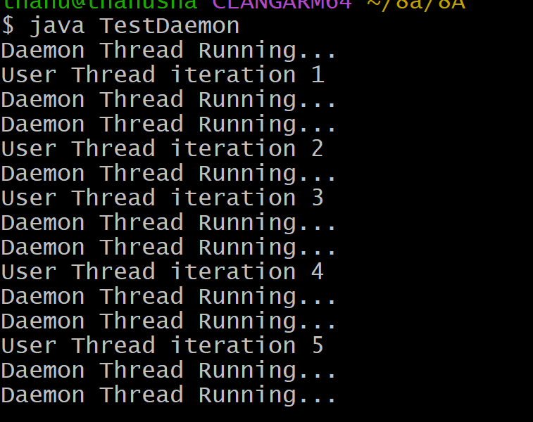
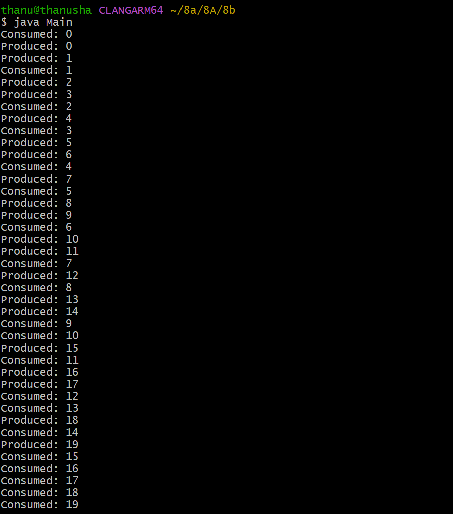
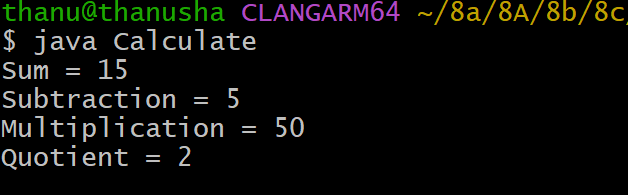

# EXPERIMENT-8
## TITLE- 8a.)Daemon Threads
```java
class DaemonThread extends Thread {
    public void run() {
        while (true) {
            System.out.println("Daemon Thread Running...");
            try {
                Thread.sleep(500);
            }
catch (InterruptedException e) {
System.out.println(e);
 }
  }
    }
}
class UserThread extends Thread {
    public void run() {
        for (int i = 1; i <= 5; i++) {
            System.out.println("User Thread iteration " + i);
 try {
                Thread.sleep(1000);
            } catch (InterruptedException e) {
                System.out.println(e);
            }
        }
    }
}
public class TestDaemon {
    public static void main(String[] args) {
        UserThread ut = new UserThread();
        DaemonThread dt = new DaemonThread();
        dt.setDaemon(true);   
        ut.start();           
        dt.start();           
    }
}
```
OUTPUT :



## TITLE- 8b.) Producer Consumer problem using java program
```
class SharedBuffer {
    private int[] buffer;
    private int count = 0;
    private int in = 0;
    private int out = 0;
    public SharedBuffer(int size) {
        buffer = new int[size];
    }
public synchronized void produce(int item) {
        try {
            while (count == buffer.length) {
                wait();
  }
  buffer[in] = item;
            in = (in + 1) % buffer.length;
            count++;
            notify();
        } catch (InterruptedException e) {
            System.out.println(e);
        }
    }
public synchronized int consume() {
        int item = 0;
 try {
            while (count == 0) {
                wait();
            }
            item = buffer[out];
            out = (out + 1) % buffer.length;
            count--;
    notify();
        } catch (InterruptedException e) {
            System.out.println(e);
        }
        return item;
    }
}
class Producer extends Thread {
    private SharedBuffer buffer;
    public Producer(SharedBuffer buffer) {
        this.buffer = buffer;
    }
public void run() {
        for (int i = 0; i < 20; i++) {
            buffer.produce(i);
            System.out.println("Produced: " + i);
            try {
                Thread.sleep(500);
            } catch (InterruptedException e) {
                System.out.println(e);
            }
        }
    }
}
class Consumer extends Thread {
    private SharedBuffer buffer;
    public Consumer(SharedBuffer buffer) {
        this.buffer = buffer;
    }
    public void run() {
        for (int i = 0; i < 20; i++) {
            int item = buffer.consume();
            System.out.println("Consumed: " + item);
            try {
                Thread.sleep(800);
            } catch (InterruptedException e) {
                System.out.println(e);
            }
        }
    }
}
public class Main {
    public static void main(String[] args) {
        SharedBuffer buffer = new SharedBuffer(5);
        Producer p = new Producer(buffer);
        Consumer c = new Consumer(buffer);
   p.start();
        c.start();
    }
}

```
OUTPUT :



## TITLE-8c.) User defined packages
```
package arithmetic;
public class ArithmeticOperations {
    public int addition(int x, int y) {
        return x + y;
    }
 public int subtraction(int x, int y) {
        return x - y;
    }
    public int multiplication(int x, int y) {
        return x * y;
    }
public int division(int x, int y) {
        return x / y;
    }
}

import arithmetic.ArithmeticOperations;
public class Calculate {
    public static void main(String[] args) {
        ArithmeticOperations ae = new ArithmeticOperations();
        int sum = ae.addition(10, 5);
        System.out.println("Sum = " + sum);
        int sub = ae.subtraction(10, 5);
        System.out.println("Subtraction = " + sub);
        int prod = ae.multiplication(10, 5);
        System.out.println("Multiplication = " + prod);
 int quot = ae.division(10, 5);
        System.out.println("Quotient = " + quot);
    }
}
```

OUTPUT :

